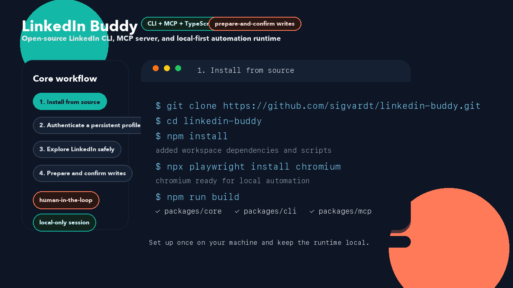
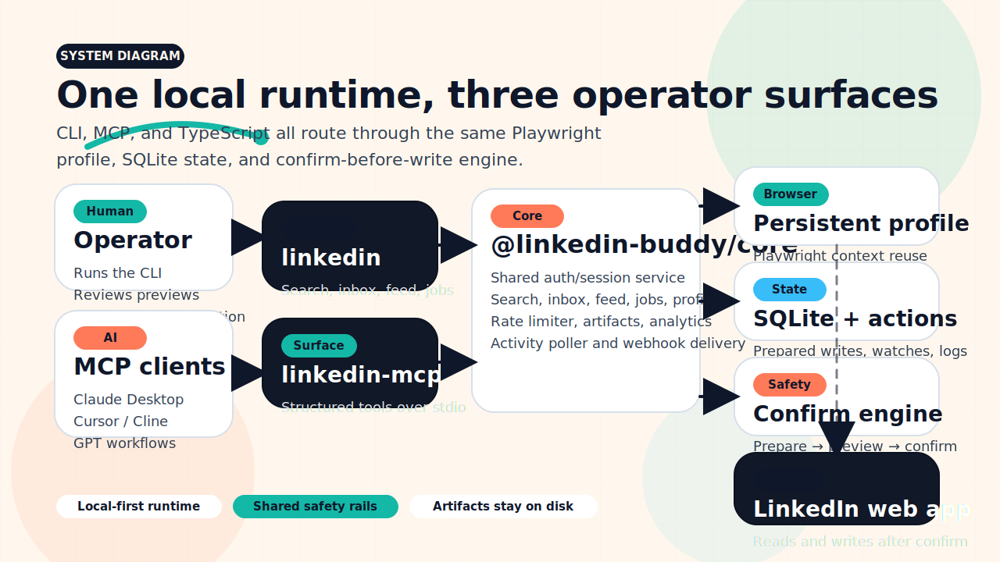
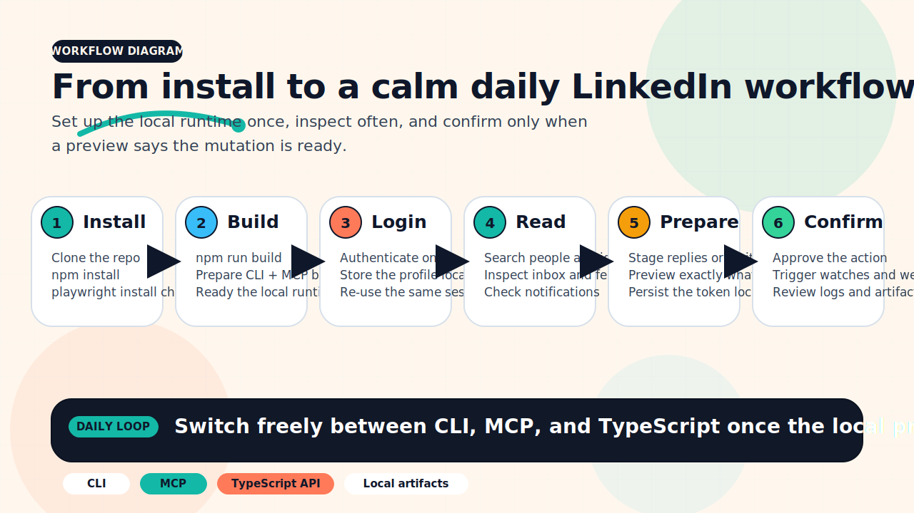
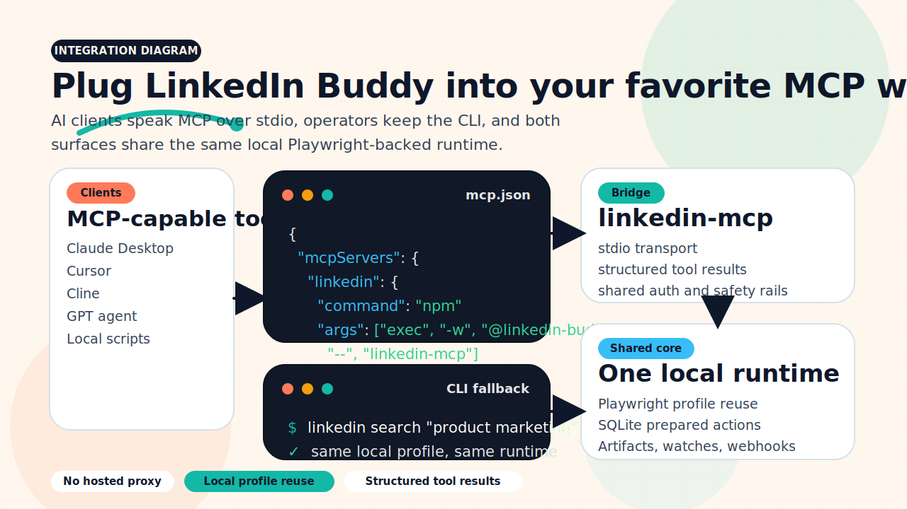
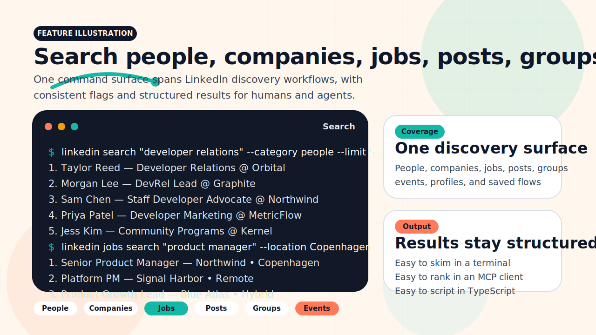
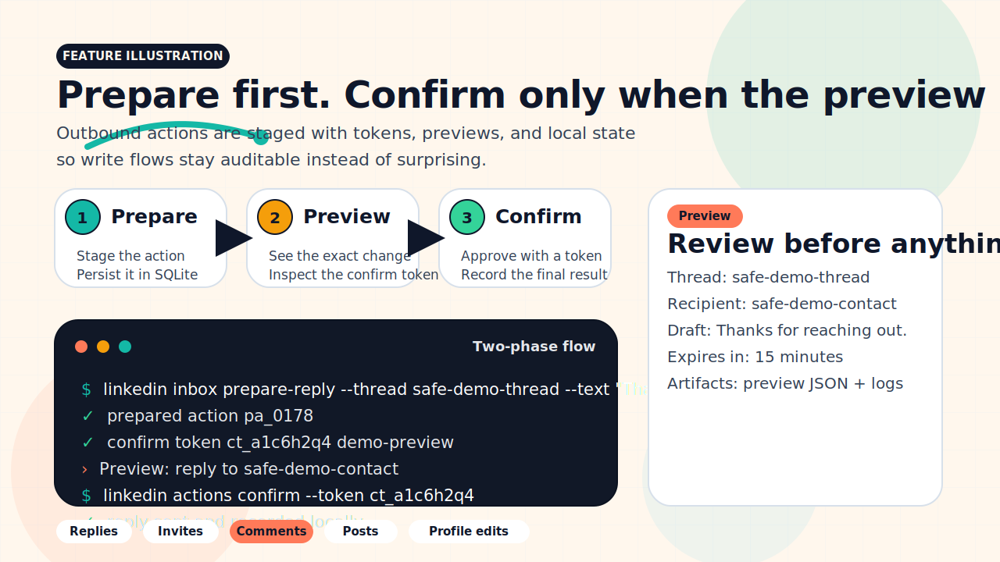
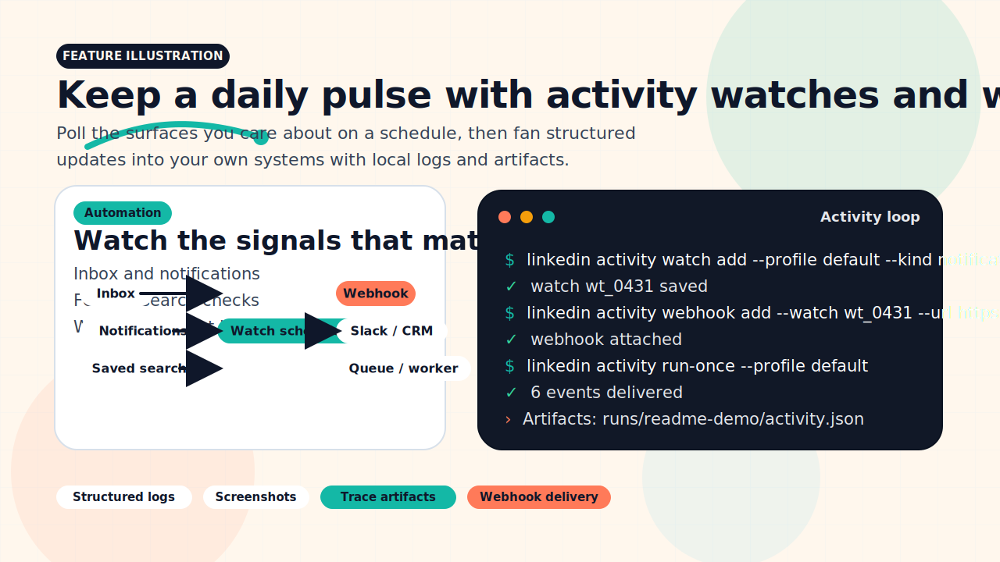
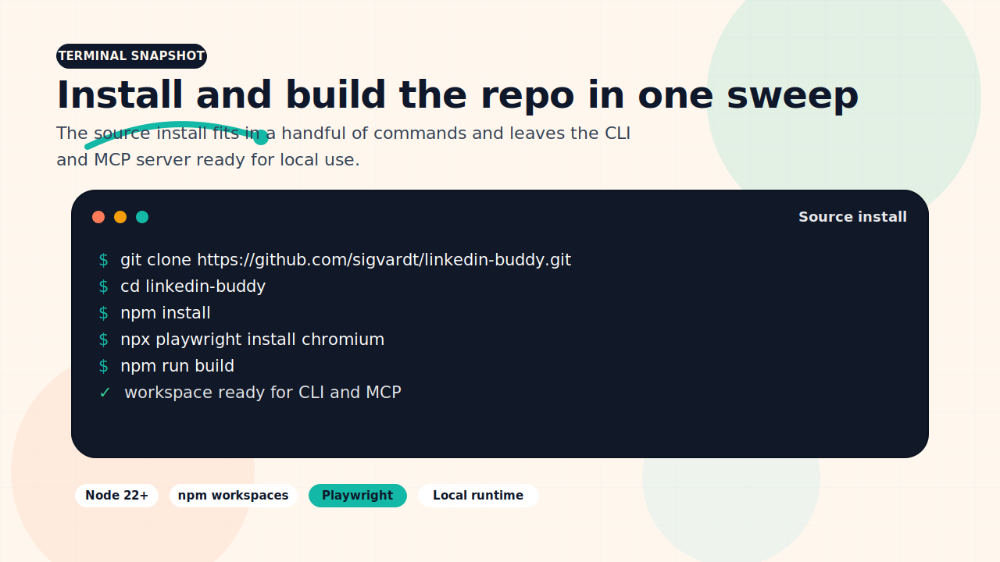
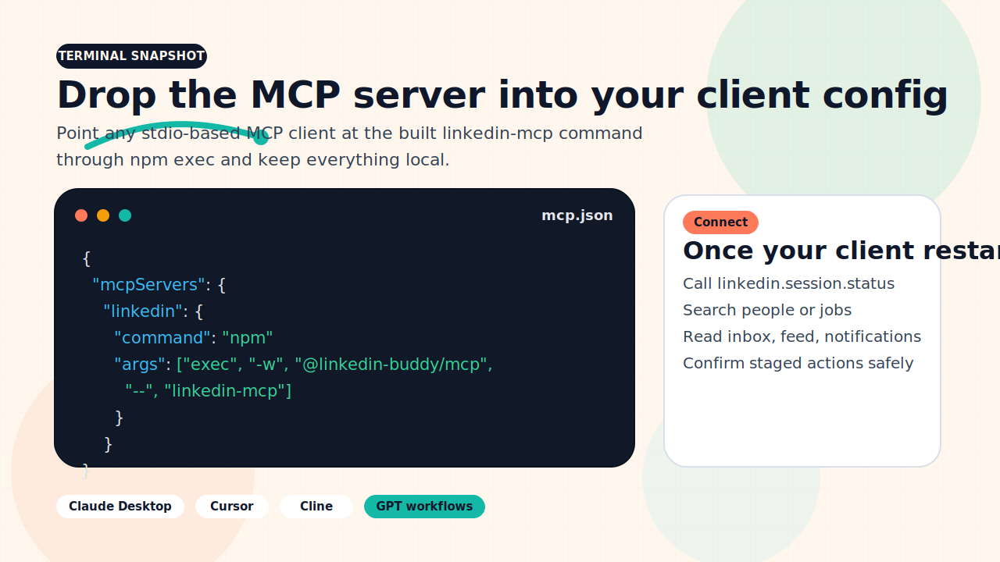
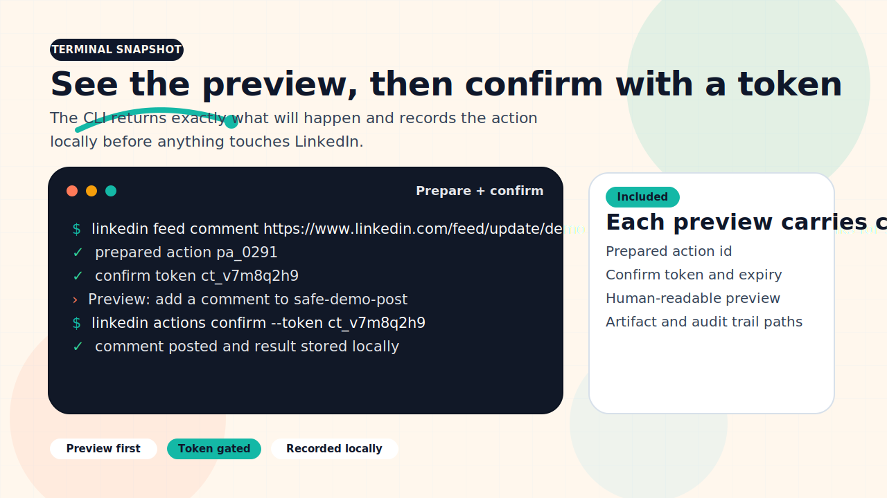

<p align="center">
  
</p>

<h1 align="center">LinkedIn Buddy</h1>

<p align="center">
  <strong>Open-source LinkedIn MCP server, LinkedIn CLI, and TypeScript automation toolkit for inbox, search, feed, jobs, profile, and agent-driven workflows.</strong>
</p>

<p align="center">
  <a href="https://github.com/sigvardt/linkedin-buddy/actions/workflows/ci.yml"></a>
  <a href="https://www.npmjs.com/"></a>
  <a href="https://www.npmjs.com/"></a>
  <a href="https://github.com/sigvardt/linkedin-buddy/stargazers"></a>
  <a href="https://modelcontextprotocol.io/"></a>
  <a href="https://nodejs.org/"></a>
  <a href="https://www.typescriptlang.org/"></a>
  <a href="#footer"></a>
</p>

<p align="center">
  <code>git clone https://github.com/sigvardt/linkedin-buddy.git && cd linkedin-buddy && npm install && npx playwright install chromium && npm run build</code>
</p>

<p align="center">
  Install from source today while npm publishing is being finalized.
</p>

<p align="center">
  <a href="#quick-start">Quick start</a> •
  <a href="#demo">Demo</a> •
  <a href="#visual-tour">Visual tour</a> •
  <a href="#mcp-quick-connect">MCP quick connect</a> •
  <a href="#usage-examples">Usage examples</a> •
  <a href="#comparison-table">Comparison table</a> •
  <a href="./docs/repository-seo.md">SEO playbook</a>
</p>

## Why LinkedIn Buddy?

LinkedIn Buddy gives you three linked surfaces in one repo:

- `linkedin-mcp`: a LinkedIn MCP server for Claude Desktop, Cursor, Cline, and other MCP-compatible clients.
- `linkedin`: a LinkedIn CLI for operators, scripts, and local automation workflows.
- `@linkedin-buddy/core`: a TypeScript API for building your own LinkedIn automations on top of the shared runtime.

This project is **not** LinkedIn's official partner API. It is a local, Playwright-backed LinkedIn automation toolkit with a developer API, an MCP server, and a CLI built around safer prepare-and-confirm write flows.

## Feature Showcase

| Surface                | What it gives you                                                                                                                                                    |
| ---------------------- | -------------------------------------------------------------------------------------------------------------------------------------------------------------------- |
| `linkedin` CLI         | Search people, companies, jobs, groups, and events; inspect inbox, feed, notifications, profiles, and companies; run health checks and audits.                       |
| `linkedin-mcp`         | Expose LinkedIn tools to AI agents through Model Context Protocol, including search, inbox, jobs, feed, notifications, profile, company, and activity polling tools. |
| `@linkedin-buddy/core` | Embed the runtime in TypeScript apps with shared services for search, inbox, feed, jobs, notifications, profile, analytics, and activity polling.                    |
| Two-phase writes       | Prepare, preview, and confirm real LinkedIn mutations such as replies, invites, comments, follows, profile edits, and posts.                                         |
| Local-first runtime    | Persistent Playwright profiles, SQLite state, structured logs, screenshots, and trace artifacts stay on your machine.                                                |
| Activity + webhooks    | Poll LinkedIn activity, manage watches, and fan out webhook deliveries from the shared local runtime.                                                                |

## Quick Start

### 1. Install dependencies and browsers

```bash
git clone https://github.com/sigvardt/linkedin-buddy.git
cd linkedin-buddy
npm install
npx playwright install chromium
npm run build
```

### 2. Authenticate a persistent LinkedIn profile

```bash
npm exec -w @linkedin-buddy/cli -- linkedin login --profile default
npm exec -w @linkedin-buddy/cli -- linkedin status --profile default
```

Prefer manual encrypted session capture instead of browser-based login?

```bash
npm exec -w @linkedin-buddy/cli -- linkedin auth session --session default
```

### 3. Run your first command

```bash
npm exec -w @linkedin-buddy/cli -- linkedin search "developer relations" --category people --limit 5
```

> **Tip:** The CLI installs three equivalent binaries — `linkedin`, `linkedin-buddy`, and `lbud`. After a global `npm install` (once published) any of these work directly:
>
> ```bash
> lbud search "developer relations" --category people --limit 5
> ```

## Demo

<p align="center">
  
</p>

<p align="center">
  Safe demo data only — the README media does not embed live LinkedIn content.
</p>

## Visual Tour

| Architecture                                                                                                                                                                                   | Workflow                                                                                                                               |
| ---------------------------------------------------------------------------------------------------------------------------------------------------------------------------------------------- | -------------------------------------------------------------------------------------------------------------------------------------- |
|  |  |

| Integrations                                                                                                                                                                                            |
| ------------------------------------------------------------------------------------------------------------------------------------------------------------------------------------------------------- |
|  |

### Feature illustrations

| Search surface                                                                                                                                                      | Confirmed actions                                                                                                                              | Activity webhooks                                                                                                              |
| ------------------------------------------------------------------------------------------------------------------------------------------------------------------- | ---------------------------------------------------------------------------------------------------------------------------------------------- | ------------------------------------------------------------------------------------------------------------------------------ |
|  |  |  |

### Terminal snapshots

| Install and build                                                                                                                            | MCP quick connect                                                                                                    | Confirm before write                                                                                                                |
| -------------------------------------------------------------------------------------------------------------------------------------------- | -------------------------------------------------------------------------------------------------------------------- | ----------------------------------------------------------------------------------------------------------------------------------- |
|  |  |  |

See [`assets/media/README.md`](./assets/media/README.md) for the organized asset inventory and size budget, and [`docs/readme-media-research.md`](./docs/readme-media-research.md) for the research notes behind the chosen formats.

## MCP Quick Connect

Point your MCP client at the local server after `npm run build`:

```json
{
  "mcpServers": {
    "linkedin": {
      "command": "npm",
      "args": ["exec", "-w", "@linkedin-buddy/mcp", "--", "linkedin-mcp"]
    }
  }
}
```

Useful tools to start with:

- `linkedin.session.status`
- `linkedin.search`
- `linkedin.inbox.list_threads`
- `linkedin.feed.list`
- `linkedin.jobs.search`
- `linkedin.notifications.list`
- `linkedin.actions.confirm`
- `linkedin.activity_poller.run_once`

## Usage Examples

### Search people, companies, posts, groups, events, or jobs

```bash
npm exec -w @linkedin-buddy/cli -- linkedin search "staff engineer" --category people --limit 5
npm exec -w @linkedin-buddy/cli -- linkedin search "open source ai" --category posts --limit 5
npm exec -w @linkedin-buddy/cli -- linkedin jobs search "product manager" --location Copenhagen --limit 10
```

### Read inbox threads and prepare a reply

```bash
npm exec -w @linkedin-buddy/cli -- linkedin inbox list --limit 10
npm exec -w @linkedin-buddy/cli -- linkedin inbox show --thread <thread-url-or-id> --limit 20
npm exec -w @linkedin-buddy/cli -- linkedin inbox prepare-reply --thread <thread-url-or-id> --text "Thanks for reaching out."
npm exec -w @linkedin-buddy/cli -- linkedin actions confirm --token ct_...
```

### Browse the feed and stage a comment safely

```bash
npm exec -w @linkedin-buddy/cli -- linkedin feed list --limit 5
npm exec -w @linkedin-buddy/cli -- linkedin feed view <post-url>
npm exec -w @linkedin-buddy/cli -- linkedin feed comment <post-url> --text "Insightful breakdown. Thanks for sharing."
npm exec -w @linkedin-buddy/cli -- linkedin actions confirm --token ct_...
```

### Inspect profiles, companies, and notifications

```bash
npm exec -w @linkedin-buddy/cli -- linkedin profile view me
npm exec -w @linkedin-buddy/cli -- linkedin company view openai
npm exec -w @linkedin-buddy/cli -- linkedin notifications list --limit 20
```

### Run activity polling and webhook delivery

```bash
npm exec -w @linkedin-buddy/cli -- linkedin activity watch add --profile default --kind notifications --interval-seconds 600
npm exec -w @linkedin-buddy/cli -- linkedin activity webhook add --watch <watch-id> --url https://example.com/hooks/linkedin
npm exec -w @linkedin-buddy/cli -- linkedin activity run-once --profile default
```

### Use the TypeScript API directly

```ts
import { createCoreRuntime } from "@linkedin-buddy/core";

const runtime = createCoreRuntime();

try {
  const result = await runtime.search.search({
    profileName: "default",
    category: "people",
    query: "developer relations",
    limit: 5,
  });

  console.log(result.results.map((person) => person.name));
} finally {
  runtime.close();
}
```

## Comparison Table

Quick positioning snapshot for people evaluating LinkedIn MCP, LinkedIn CLI, and LinkedIn API-style tools.

| Tool                                                                                        | CLI               | MCP server | Dev library / API          | Confirm-before-write flow  | Best fit                                                   |
| ------------------------------------------------------------------------------------------- | ----------------- | ---------- | -------------------------- | -------------------------- | ---------------------------------------------------------- |
| **LinkedIn Buddy**                                                                          | Yes               | Yes        | Yes                        | Yes                        | Local-first LinkedIn workflows for operators and AI agents |
| [`stickerdaniel/linkedin-mcp-server`](https://github.com/stickerdaniel/linkedin-mcp-server) | No advertised CLI | Yes        | No advertised core package | No advertised confirm flow | MCP access focused on LinkedIn scraping and job search     |
| [`tigillo/linkedin-cli`](https://github.com/tigillo/linkedin-cli)                           | Yes               | No         | No advertised dev package  | No advertised confirm flow | Terminal-oriented LinkedIn command usage                   |
| [`alabarga/linkedin-api`](https://github.com/alabarga/linkedin-api)                         | No                | No         | Yes                        | No advertised confirm flow | Library-style LinkedIn integrations                        |

See [`docs/repository-seo.md`](./docs/repository-seo.md) for the keyword targets and the GitHub-search baseline captured for issue #245.

## Docs Map

| Need                                     | Doc                                                                      |
| ---------------------------------------- | ------------------------------------------------------------------------ |
| Repository SEO targets and metadata sync | [`docs/repository-seo.md`](./docs/repository-seo.md)                     |
| Activity polling and webhooks            | [`docs/activity-webhooks.md`](./docs/activity-webhooks.md)               |
| Anti-bot evasion profiles                | [`docs/evasion.md`](./docs/evasion.md)                                   |
| E2E and replay testing                   | [`docs/e2e-testing.md`](./docs/e2e-testing.md)                           |
| Live validation and account safety       | [`docs/write-validation.md`](./docs/write-validation.md)                 |
| Selector auditing                        | [`docs/selector-audit.md`](./docs/selector-audit.md)                     |
| Draft quality evaluation                 | [`docs/draft-quality-evaluation.md`](./docs/draft-quality-evaluation.md) |
| Brand and social preview assets          | [`docs/brand-guidelines.md`](./docs/brand-guidelines.md)                 |
| README media research                    | [`docs/readme-media-research.md`](./docs/readme-media-research.md)       |
| README media inventory                   | [`assets/media/README.md`](./assets/media/README.md)                     |
| Articles and newsletters                 | [`docs/articles-newsletters.md`](./docs/articles-newsletters.md)         |
| Notifications                            | [`docs/notifications.md`](./docs/notifications.md)                       |
| Rate limiting                            | [`docs/rate-limiting.md`](./docs/rate-limiting.md)                       |

## Contributing

Contributions are welcome. Start with [`CONTRIBUTING.md`](./CONTRIBUTING.md), be respectful in [`CODE_OF_CONDUCT.md`](./CODE_OF_CONDUCT.md), and report sensitive issues through [`SECURITY.md`](./SECURITY.md).

If you change the CLI, MCP tools, or LinkedIn write flows, please update the README and the relevant docs in `docs/` so new users can discover the feature quickly.

## Star History

[](https://star-history.com/#sigvardt/linkedin-buddy&Date)

## Footer

License: pending repository selection.

Acknowledgments: built with Playwright, Commander, SQLite, and the Model Context Protocol SDK.

Docs: start in [`docs/`](./docs/) and check [`CHANGELOG.md`](./CHANGELOG.md) for release notes.
